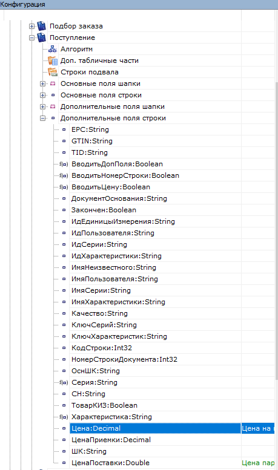
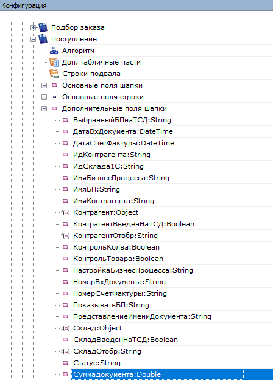
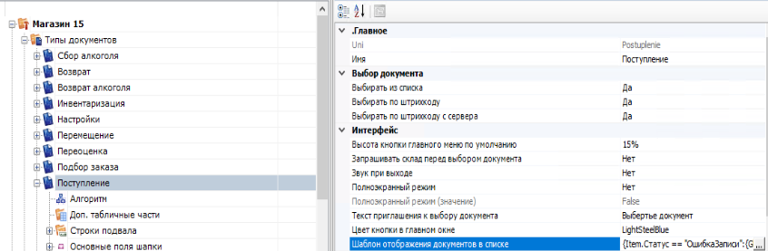
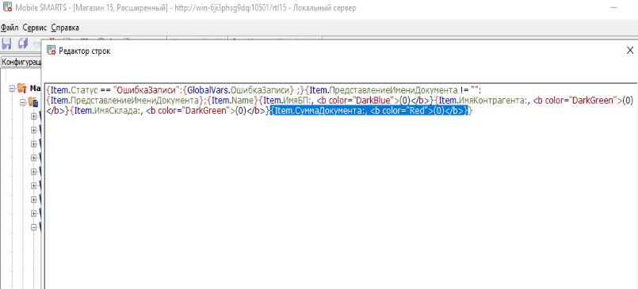

# exch_serv
Сервер прокладка для обмена данными между Супермаг и Клеверенс.

Для доступа к Oracle необходимо будет создать .env файл с содержимым:
ORACLE_PORT=Порт базы данных, обычно 1521
ORACLE_USER=ваш Oracle user
ORACLE_PASS=пароль от вашего Oracle user 
ORACLE_HOST=ip адрес сервера
ORACLE_BASE=Название базы данных

Загрузить схему в Администратор сервера обмена данными 
схема стандартная, на всякий случай схема прикладывается.
[OR.JSON](doc%2FOR.JSON)

Необходимо в конфигурации Клеверенс добавить поля:

Дополнительные поля строки:
Цена и ЦенаПоставки

И дополнительные поля шапки:
СуммаДокумента

Выбрать тип документа Поступление, в свойствах Шаблон отображения документов в списке:

Нажать редактировать и добавить поле суммы документа:

Запуск контейнера при помощи команды:
docker build . --tag exch_server --no-cache && docker run --name exch_server -p 8083:8083 --env
-file ./.env exch_server